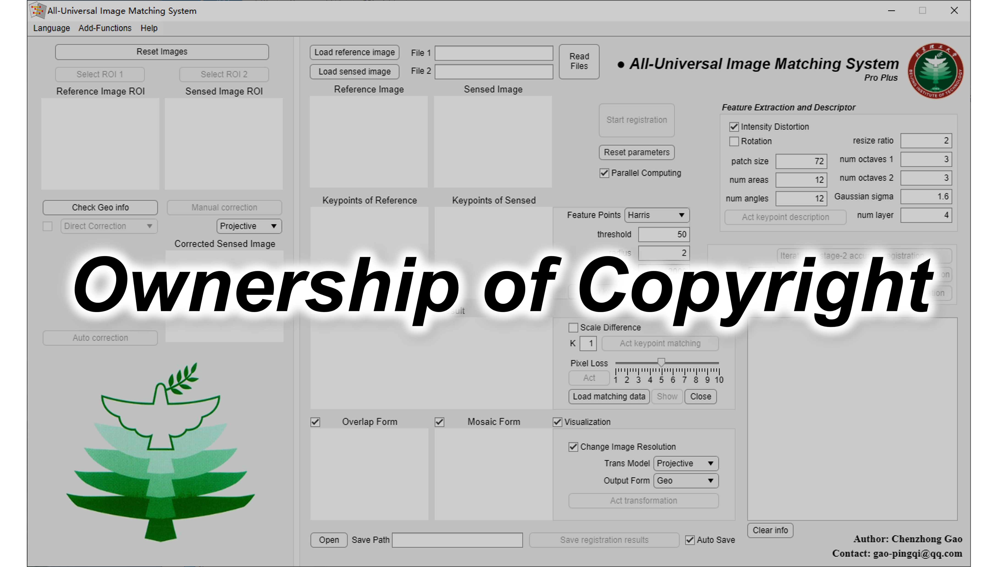
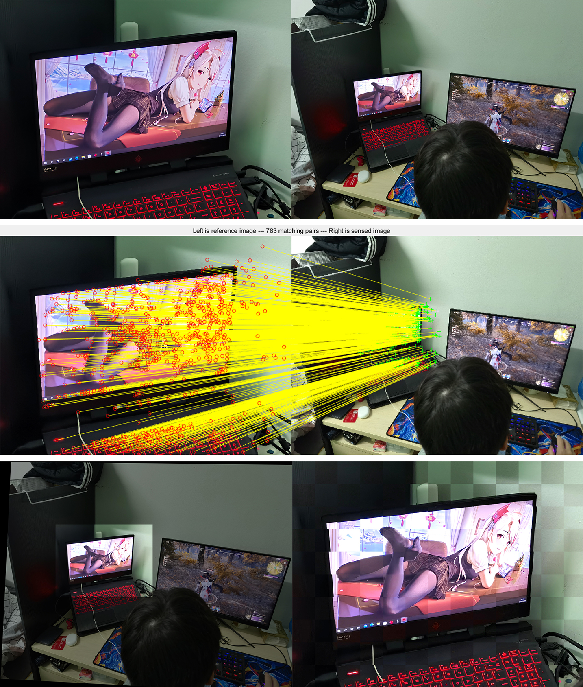
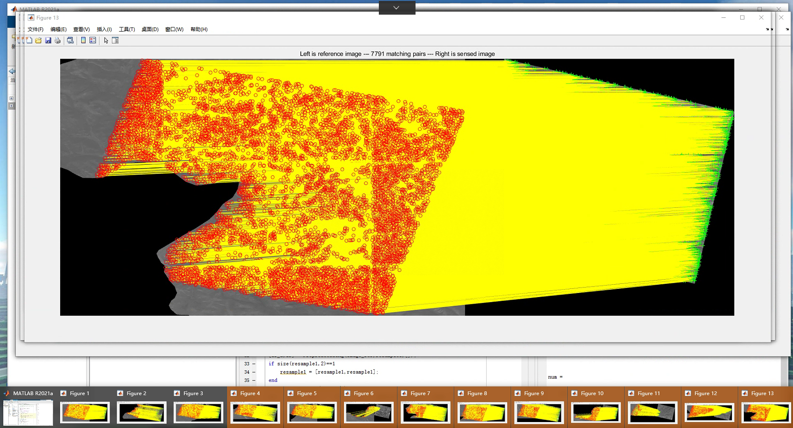
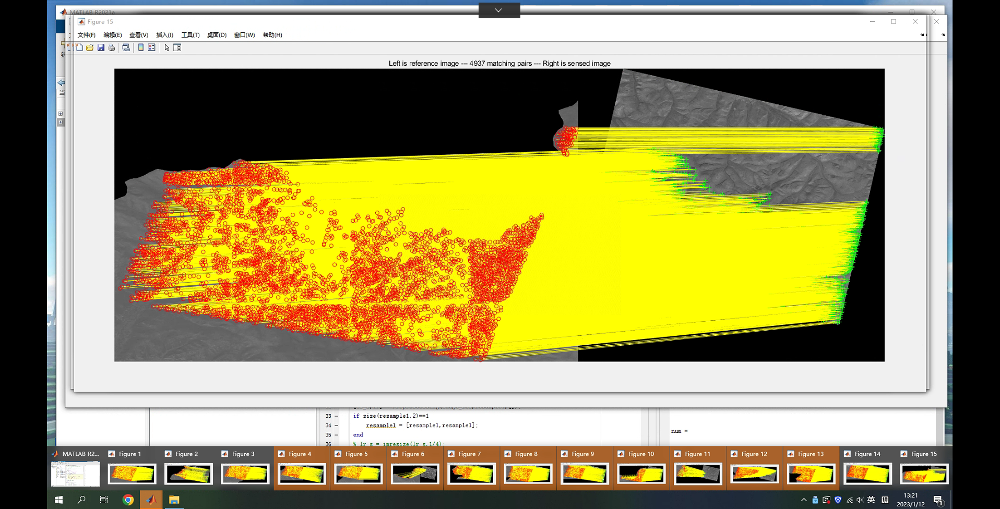
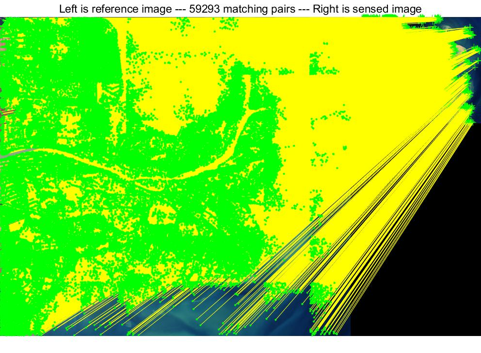
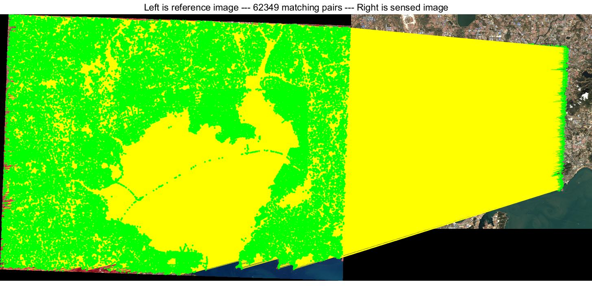

# MS-HLMO_registration-v2.1

An updated and practical version of MS-HLMO

If you have any queries or suggestions, please do not hesitate to contact me (gao-pingqi@qq.com or 3120205425@bit.edu.cn).

An image registration software based on MS-HLMO:

Here's a testing example of my righteous roommate:

Newest practical examples of multi-source remote sensing applications:

Image segmentation based on image registration ~~~ ：
 
